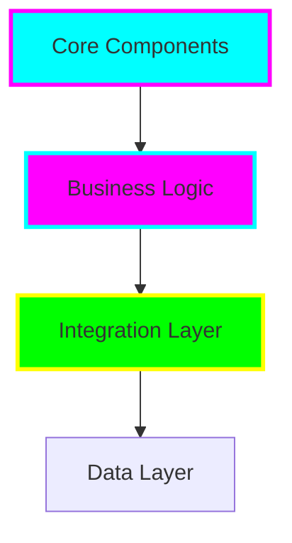

# ProtectChildrenAustralia

<div align="center">


**🌟 ProtectChildrenAustralia - Enterprise Solution**

*Professional • Scalable • Mission-Driven*

[](https://github.com/tiation/ProtectChildrenAustralia)
[](https://github.com/tiation/ProtectChildrenAustralia/blob/main/LICENSE)

</div>

## 🚀 Overview

**ProtectChildrenAustralia** is a comprehensive initiative focused on ensuring the safety and wellbeing of all children in Australia through systemic reform and innovative solutions.

> 🎯 **Mission**: Create a safer, more nurturing environment for all Australian children through economic reform, enhanced education, and family support systems.

### ✨ Key Features

#### 💰 Economic Reform
- Universal Basic Income for families
- Flexible work arrangements for parents
- Affordable childcare solutions
- Community support networks

#### 👨‍👩‍👧‍👦 Parental Support
- Extended parental leave
- Mental health resources
- Work-life balance initiatives
- Parent education programs

#### 🎓 Educational Innovation
- Montessori principles integration
- Emotional intelligence curriculum
- Social skills development
- Safe learning environments

#### 🛡️ Child Safety Measures
- Comprehensive safety protocols
- Anti-bullying initiatives
- Digital safety guidelines
- Emergency response systems

---

## 🏗️ Architecture



---

## 📦 Installation

### Quick Start

```bash
# Clone the repository
git clone https://github.com/tiation/ProtectChildrenAustralia.git
cd ProtectChildrenAustralia

# Follow installation instructions
# (See project-specific setup in the repository)
```

---

## 🎯 Usage

This project is part of the larger Tiation ecosystem. Please refer to the project documentation for specific usage instructions and integration guidelines.

---

## 📚 Documentation

- **[Project Documentation](docs/)** - Complete project documentation
- **[API Reference](docs/api.md)** - API documentation (if applicable)
- **[Contributing Guide](CONTRIBUTING.md)** - How to contribute to this project

---

## 🤝 Contributing

We welcome contributions! Please see our [Contributing Guide](CONTRIBUTING.md) for details.

### Development Setup

1. Fork the repository
2. Create a feature branch
3. Make your changes
4. Add tests if applicable
5. Submit a pull request

---

## 🔮 Tiation Ecosystem

This repository is part of the Tiation ecosystem:

- [🌟 Tiation Platform](https://github.com/tiation/tiation) - Main ecosystem platform
- [🤖 AI Platform](https://github.com/tiation/tiation-ai-platform) - Enterprise AI platform
- [🤖 AI Agents](https://github.com/tiation/tiation-ai-agents) - Intelligent automation
- [⚡ Terminal Workflows](https://github.com/tiation/tiation-terminal-workflows) - Developer tools
- [🐳 Docker Solutions](https://github.com/tiation/tiation-docker-debian) - Container orchestration

---

## 📄 License

This project is licensed under the MIT License - see the [LICENSE](LICENSE) file for details.

---

<div align="center">
  <p>
    <strong>Built with ❤️ by the Tiation Team</strong>
  </p>
  <p>
    <a href="https://github.com/tiation">
      
    </a>
  </p>
</div>
