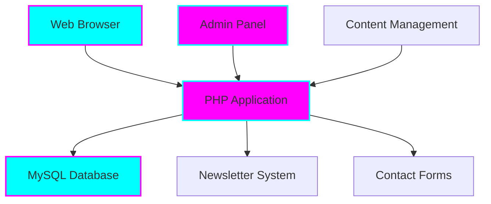

# Protect Children Australia Website

<div align="center">


**Enterprise-grade child safety resource website for Australian families and educators**

*Professional • Secure • Mission-Driven*

[](https://tiation.github.io/ProtectChildrenAustralia)
[](https://tiation.github.io/ProtectChildrenAustralia)
[](https://tiation.github.io/ProtectChildrenAustralia/docs/architecture)
[](https://github.com/tiation/ProtectChildrenAustralia)
[](https://github.com/tiation/ProtectChildrenAustralia/blob/master/LICENSE)

</div>

## 🚀 Overview

Protect Children Australia is a comprehensive, enterprise-grade resource website focused on child safety in Australia. Our platform provides accessible, evidence-based information tailored to Australian contexts and regulations for parents, educators, and caregivers.

### ✨ Key Features

- 📚 **Comprehensive Resource Library** - Curated safety information organized by categories
- 📝 **Dynamic Blog System** - Regular updates on child safety topics
- 🔐 **Secure Admin Panel** - Professional content management system
- 📧 **Newsletter Integration** - Keep users informed with latest safety updates
- 📱 **Mobile-Responsive Design** - Optimized for all devices
- 🔍 **Advanced Search** - Find relevant content quickly
- 🎨 **Professional Design** - Clean, accessible interface with dark neon theme

---

## 🏗️ Architecture


### System Components



### Technology Stack

- **Frontend**: HTML5, CSS3, JavaScript, Bootstrap 5
- **Backend**: PHP 7.4+, MySQL 5.7+
- **Database**: MySQL with PDO for secure database operations
- **Infrastructure**: GitHub Pages for documentation, traditional web hosting for application

---

## 📋 Table of Contents

- [Features](#-features)
- [Quick Start](#-quick-start)
- [Installation](#-installation)
- [Usage](#-usage)
- [Documentation](#-documentation)
- [Screenshots](#-screenshots)
- [FAQ](#-faq)
- [Contributing](#-contributing)
- [Support](#-support)
- [License](#-license)
- [About Tiation](#-about-tiation)

---

## ✨ Features

{{FEATURES_LIST}}

---

## 🏃‍♂️ Quick Start

```bash
# Clone the repository
git clone https://github.com/tiation/ProtectChildrenAustralia.git
cd ProtectChildrenAustralia

# Install PHP dependencies
composer install

# Set up database
mysql -u root -p < db/database_init.sql

# Configure settings
cp includes/config.example.php includes/config.php

# Start local development server
php -S localhost:8000
```

---

## 📦 Installation

### Prerequisites

- Web server (Apache/Nginx)
- PHP 7.4 or higher
- MySQL 5.7 or higher
- Composer (for dependency management)
- Git (optional)

### Installation Steps

1. **Clone the repository**
   ```bash
   git clone https://github.com/tiation/ProtectChildrenAustralia.git
   cd ProtectChildrenAustralia
   ```

2. **Install dependencies**
   ```bash
   composer install
   ```

3. **Configuration**
   ```bash
   # Copy configuration template
   cp includes/config.example.php includes/config.php
   
   # Edit configuration with your database credentials
   nano includes/config.php
   
   # Set up database
   mysql -u root -p < db/database_init.sql
   ```

---

## 🎯 Usage

### Basic Usage

1. **Access the website** at your configured URL
2. **Browse resources** using the category navigation
3. **Search content** using the search functionality
4. **Subscribe to newsletter** for updates
5. **Contact us** through the contact form

### Admin Panel

1. **Access admin** at `/admin/`
2. **Login** with admin credentials
3. **Manage content** through the dashboard
4. **Add blog posts** and resources
5. **Monitor subscribers** and messages

### API Usage

```php
// Example API call to get posts
$posts = getPostsByCategory('online-safety');

// Example contact form submission
submitContactForm($name, $email, $message);
```

---

## 📚 Documentation

- **[User Guide](docs/user-guide.md)** - Complete user documentation
- **[API Reference](docs/api-reference.md)** - Technical API documentation
- **[Architecture](docs/architecture.md)** - System architecture overview
- **[Deployment Guide](docs/deployment.md)** - Production deployment instructions
- **[Developer Guide](docs/developer-guide.md)** - Development setup and guidelines

### Live Documentation

Visit our [GitHub Pages site](https://tiation.github.io/ProtectChildrenAustralia) for interactive documentation.

---

## 📸 Screenshots

<div align="center">
  
  <p><em>Homepage with dark neon theme</em></p>
</div>

<div align="center">
  
  <p><em>Admin dashboard interface</em></p>
</div>

<div align="center">
  
  <p><em>Resource library page</em></p>
</div>

---

## ❓ FAQ

### General Questions

**Q: What makes this solution enterprise-grade?**
A: Our solution includes comprehensive security, scalability, monitoring, and enterprise integration features with professional support.

**Q: Is this compatible with existing systems?**
A: Yes, we provide extensive API and integration capabilities for seamless system integration.

**Q: What support options are available?**
A: We offer community support through GitHub Issues and professional enterprise support for commercial users.

### Technical Questions

**Q: What are the system requirements?**
A: Web server with PHP 7.4+, MySQL 5.7+, and at least 1GB RAM for optimal performance.

**Q: How do I handle large scale deployments?**
A: See our [Deployment Guide](docs/deployment.md) for enterprise-scale deployment strategies.

**Q: Are there any security considerations?**
A: Yes, please review our [Security Policy](SECURITY.md) for comprehensive security best practices.

### Troubleshooting

**Q: Common installation issues**
A: Check our [Troubleshooting Guide](docs/troubleshooting.md) for solutions to common problems.

**Q: Performance optimization**
A: Refer to our [Troubleshooting Guide](docs/troubleshooting.md) for performance optimization strategies.

---

## 🤝 Contributing

We welcome contributions! Please see our [Contributing Guide](CONTRIBUTING.md) for details.

### Development Setup

1. Fork the repository
2. Create a feature branch
3. Make your changes
4. Add tests
5. Submit a pull request

### Code of Conduct

Please read our [Code of Conduct](CODE_OF_CONDUCT.md) before contributing.

---

## 🆘 Support

### Community Support

- **GitHub Issues**: [Report bugs or request features](https://github.com/tiation/ProtectChildrenAustralia/issues)
- **Discussions**: [Join community discussions](https://github.com/tiation/ProtectChildrenAustralia/discussions)
- **Documentation**: [Browse our documentation](https://tiation.github.io/ProtectChildrenAustralia)

### Enterprise Support

For enterprise customers, we offer:
- Priority support
- Custom development
- Training and consultation
- SLA guarantees

Contact us at [tiatheone@protonmail.com](mailto:tiatheone@protonmail.com)

---

## 🔮 Tiation Ecosystem

This repository is part of the Tiation ecosystem. Explore related projects:

- [🌟 Tiation Platform](https://github.com/tiation/tiation-ai-platform) - Enterprise AI platform
- [🤖 AI Agents](https://github.com/tiation/tiation-ai-agents) - Intelligent automation
- [⚡ Terminal Workflows](https://github.com/tiation/tiation-terminal-workflows) - Developer tools
- [🐳 Docker Solutions](https://github.com/tiation/tiation-docker-debian) - Container orchestration
- [📝 CMS](https://github.com/tiation/tiation-cms) - Content management system
- [🐰 ChaseWhiteRabbit NGO](https://github.com/tiation/tiation-chase-white-rabbit-ngo) - Social impact initiatives
- [🏗️ Infrastructure](https://github.com/tiation/tiation-rigger-infrastructure) - Enterprise infrastructure

---

## 📄 License

This project is licensed under the MIT License - see the [LICENSE](LICENSE) file for details.

---

## 🌟 About Tiation

**Tiation** is a leading provider of enterprise-grade software solutions, specializing in automation, productivity, and system integration tools. Our mission is to empower organizations with cutting-edge technology that drives efficiency and innovation.

### Our Solutions

- **Automation Platform**: Comprehensive business process automation
- **Developer Tools**: Professional development and deployment tools
- **Enterprise Integration**: Seamless system integration solutions
- **Security Framework**: Advanced security and compliance tools

### Connect With Us

- **Website**: [https://github.com/tiation](https://github.com/tiation)
- **GitHub**: [https://github.com/tiation](https://github.com/tiation)
- **LinkedIn**: [Tiation Company](https://linkedin.com/company/tiation)
- **Twitter**: [@TiationTech](https://twitter.com/TiationTech)

---

<div align="center">
  <p>
    <strong>Built with ❤️ by the Tiation Team</strong>
  </p>
  <p>
    <a href="https://github.com/tiation">
      
    </a>
  </p>
</div>
